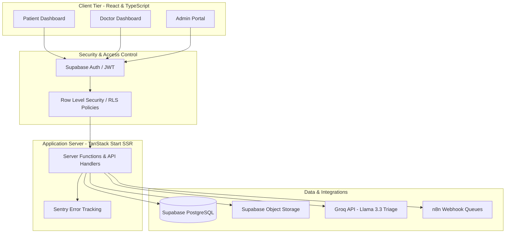

# Naaga Sumukh B S

Information Science and Engineering student specializing in full-stack engineering, secure system architectures, and workflow automation. My research and development efforts focus on designing proprietary systems, database security architectures, and automated artificial intelligence workflows.

As the Founder and Head of Team Adwaitha, I direct development teams, design system architectures, and coordinate research for technical projects.

---

## Developer Notice: Contribution Activity

Because my primary engineering work involves proprietary systems and intellectual property currently undergoing patent evaluation, my source repositories are set to private. 

To view my active development cadence, please ensure that you have enabled **Show private contributions** in your GitHub settings. This will display my daily commit history and development velocity.

---

## Technical Stack & Competencies

### Languages & Core Engineering

### Frameworks & Libraries

### Data Systems & Infrastructure

---

## Architecture Design: Full-Stack Secure Operating System

Below is the design pattern implemented for MediConnect, representing a secure, role-based database architecture and AI-assisted triage pipeline.

---

## Research & Intellectual Property Focus

### Healthcare System Workflow Automation
* Focus: Optimizing patient scheduling loops, preventing reservation race conditions, and executing secure, role-based digital consultations.
* Application: MediConnect Care Systems.

### Credential Integrity Verification
* Focus: Design of tamper-proof verification pipelines for career credentials and employment records.
* Application: Job Verify Framework.

### System Safety and Sanitization
* Focus: Prevention of injection attacks in conversational AI systems and securing server-side endpoints from telemetry leaks.
* Application: AI Triage Integrations.

---

## Engineering Standards

| Standard | Implementation | Outcome |
| --- | --- | --- |
| Type Safety | Strict TypeScript compilation and database schemas. | Eliminate runtime model mismatches. |
| Data Isolation | Row Level Security (RLS) checked via Supabase tokens. | Strict tenant and user data privacy. |
| Diagnostics | SSR-safe telemetry capturing and Sentry logging. | Real-time production issue tracking. |
| Asynchronous Execution | Create-before-cancel order scheduling patterns. | Avoid server-side race conditions. |

---

## Education
* B.E. in Information Science and Engineering (ISE)
* Nitte Meenakshi Institute of Technology (NMIT), Bangalore
* Research Focus: Applied Machine Learning, Secure Software Architecture, Distributed Database Systems

---

## Professional Networks
* LinkedIn: [linkedin.com/in/naagasumukh](https://linkedin.com/in/naagasumukh)
* GitHub: [github.com/naagasumukh8](https://github.com/naagasumukh8)
* Email: [1nt23is136.naaga@nmit.ac.in](mailto:1nt23is136.naaga@nmit.ac.in)
